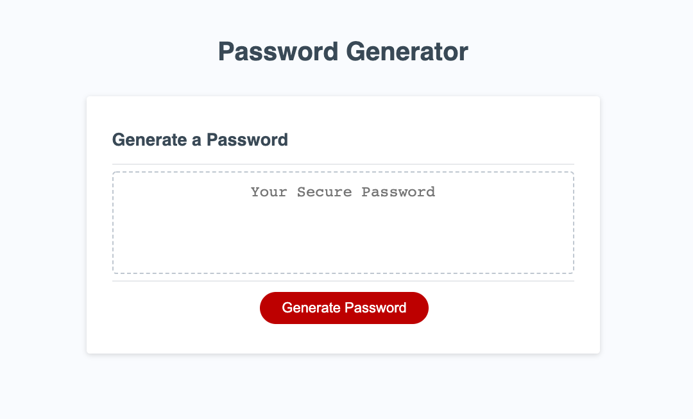
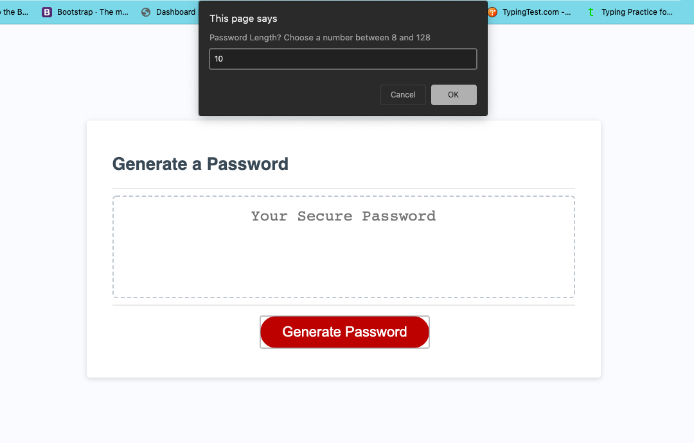
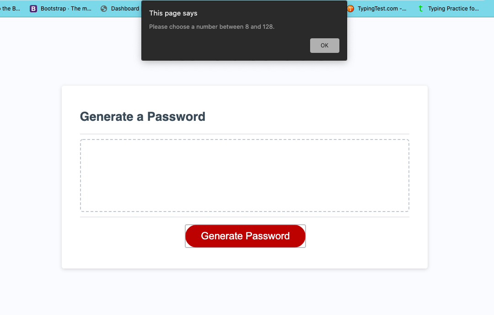
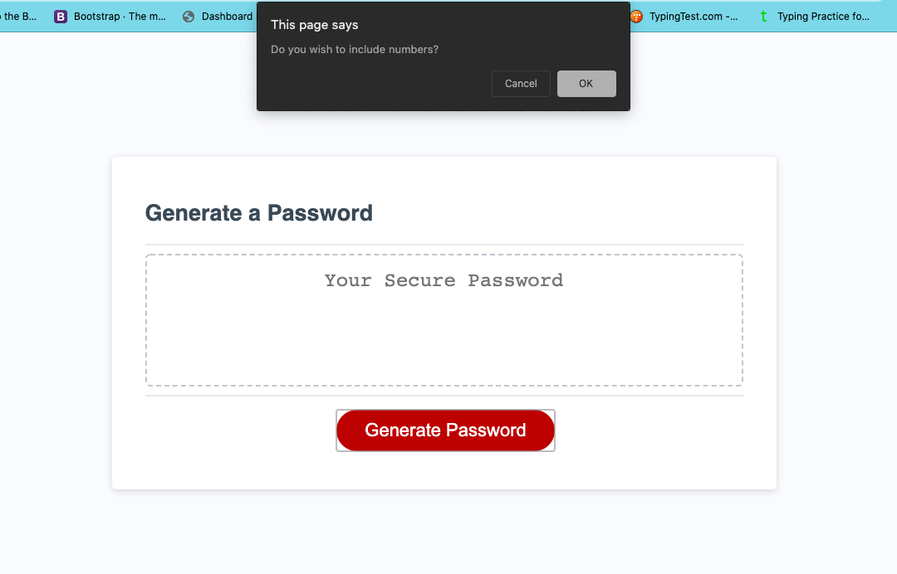
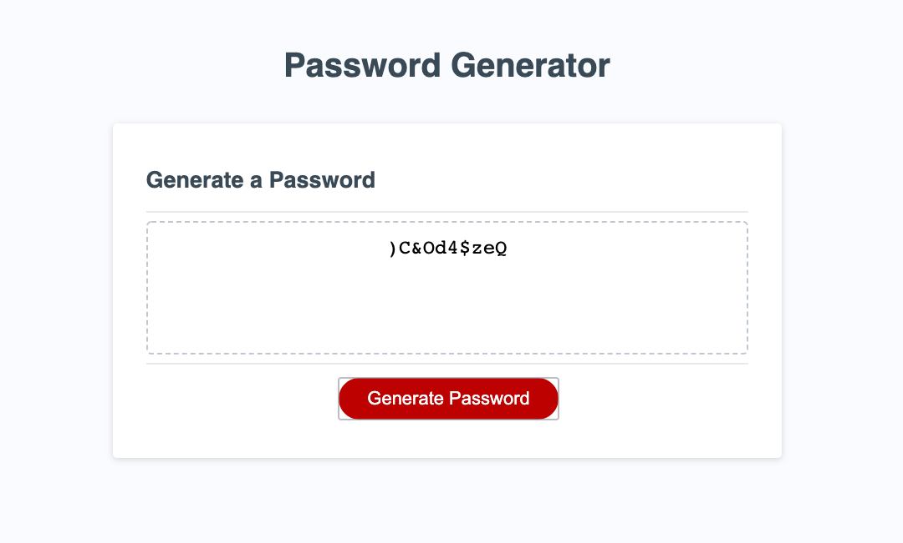

# Password-Generator

**Description**

This Program was created to generate passwords based on information gathered from the user. It will generate a password from 8 to 128 characters. It can include upper and lowercase letters, numbers, and special characters based on the users input.

I specifically worked on the script.js file. I worked on the return function that generates the password. Within the return function I created prompts and confirms to collect user data, variables to store the user data, conditionals to confirm user choices and a loop to create the password based on the user choices.

**Installation**

Click on the settings tab.
Scroll down to the section that says GitHub Pages.
Click on the link in the green box next to "your site is published at".

Or you can just click here: https://dnfrancis22.github.io/Password-Generator/

**Usage**

When the page loads you see a heading of Password Generator. A box that says Generate a Password. an empty box that says Your Secure Password. And a red button that says Generate Password.

When you click on the Generate Password button, you are prompted to pick a number between 8 amd 128.

  
You enter the length that you want your password to be.

If you enter a number that is less than 8 or greater than 28, you will get an alert that tells you to choose a number between 8 amd 128.

You will be prompted to pick a number between 8 amd 128 a second time.

After you have entered a valid password length, you will be prompted to choose if you would like to include lowercase letters.

Click ok if you want to include lowercase letters. Click cancel if you do not.

Next you will be prompted to choose if you would like to include uppercase letters.

Click ok if you want to include uppercase letters. Click cancel if you do not.

Next you will be prompted to choose if you would like to include numbers.

Click ok if you want to include numbers. Click cancel if you do not.

And finally you will be prompted to choose if you would like to include special characters.

Click ok if you want to include special characters. Click cancel if you do not.

If you clicked cancel on all of the character type prompts, you will be alerted that you must choose a character type. Then the character type prompts will start all over again.

After you have entered a valid password length and valid responses to the character type prompts, a password will be generated and displayed in the box on the screen. you can copy and paste as you like.

If you want to create another password, just click the red Generate password button and the process will start again.

**License**

MIT License

Copyright (c) [2020] [Dennis Francis]

Permission is hereby granted, free of charge, to any person obtaining a copy
of this software and associated documentation files (the "Software"), to deal
in the Software without restriction, including without limitation the rights
to use, copy, modify, merge, publish, distribute, sublicense, and/or sell
copies of the Software, and to permit persons to whom the Software is
furnished to do so, subject to the following conditions:

The above copyright notice and this permission notice shall be included in all
copies or substantial portions of the Software.

THE SOFTWARE IS PROVIDED "AS IS", WITHOUT WARRANTY OF ANY KIND, EXPRESS OR
IMPLIED, INCLUDING BUT NOT LIMITED TO THE WARRANTIES OF MERCHANTABILITY,
FITNESS FOR A PARTICULAR PURPOSE AND NONINFRINGEMENT. IN NO EVENT SHALL THE
AUTHORS OR COPYRIGHT HOLDERS BE LIABLE FOR ANY CLAIM, DAMAGES OR OTHER
LIABILITY, WHETHER IN AN ACTION OF CONTRACT, TORT OR OTHERWISE, ARISING FROM,
OUT OF OR IN CONNECTION WITH THE SOFTWARE OR THE USE OR OTHER DEALINGS IN THE
SOFTWARE.

